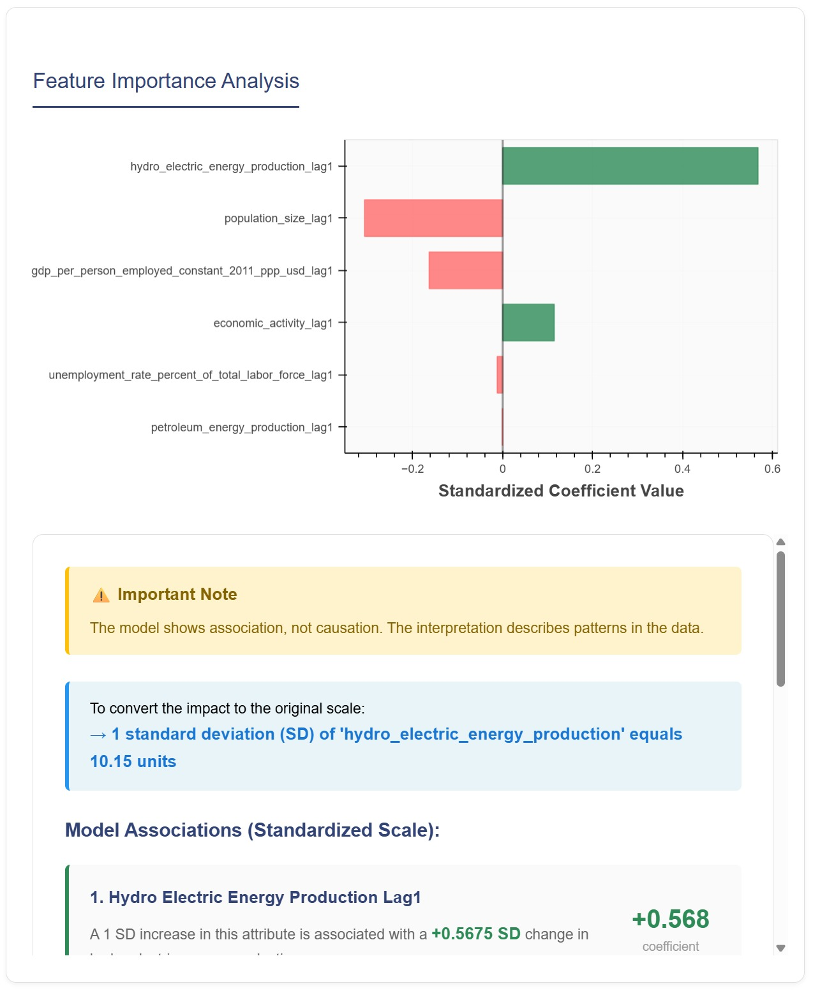

# ml-macro

## Overview
ml-macro is a Python-based project for analyzing global macroeconomic data with machine learning.
it automates:
- metadata generation
- data download from World Bank, IMF, OECD and Brazilian government APIs
- Data ingestion, cleaning, reshaping into a high-level api
- Quality checks and missing-value diagnostic via heatmaps and health reports

it offers:
- Linear regression modeling and evaluation with high interpretability
- LSTM modeling with high-expressive power
- interactive dashboard for data exploration and ML diagnosis

## Use-case

remember to setup enviornment and install requirements.

to acquire the data, a single run of `00_preprocess.ipynb` will:
- download all the data
- execute filtering
- cleaning pipeline

`01_usage.ipynb` : contain examples of high-level dataset api

`02_missing.ipynb` : perform the anaysis of missing values

`10_model.ipynb` : train LSTM pipeline

`20_explain.ipynb` : run shapley values on LSTM

for opening dashboard, a single call of:
`python3 -m bokeh serve src/dashboard --show --port 5007`
must be enough.

